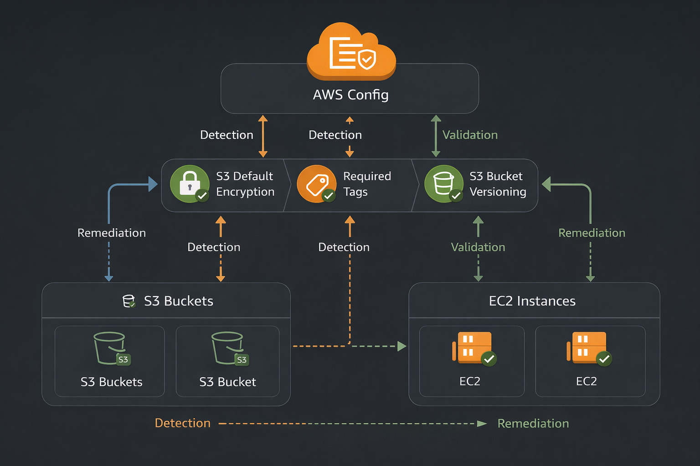
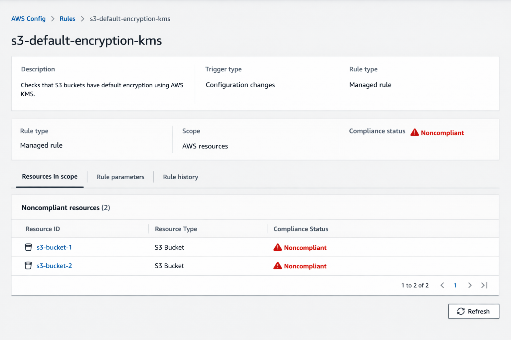
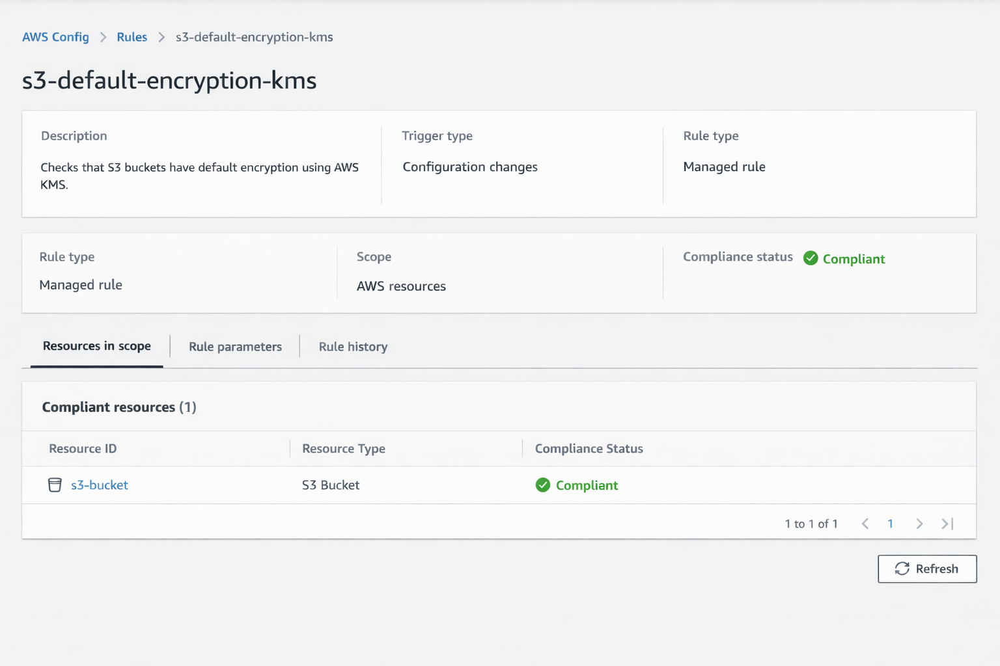
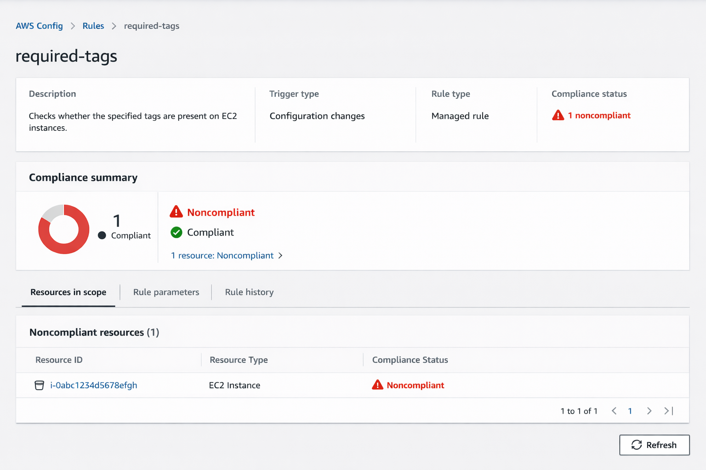
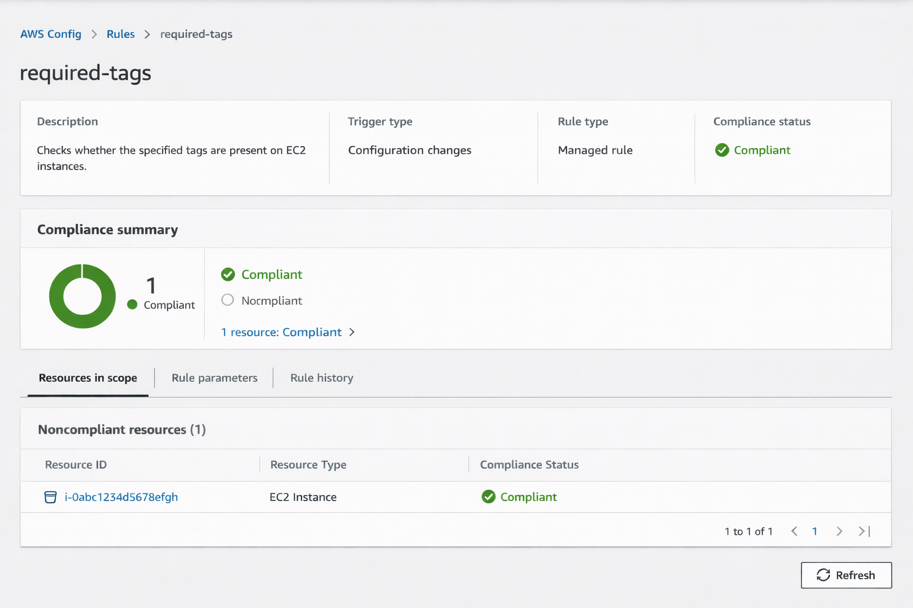
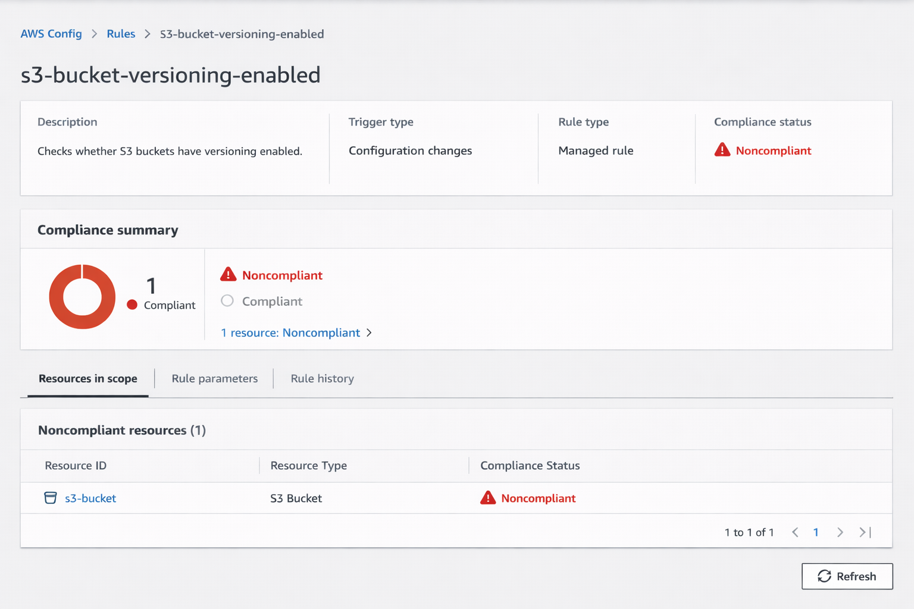
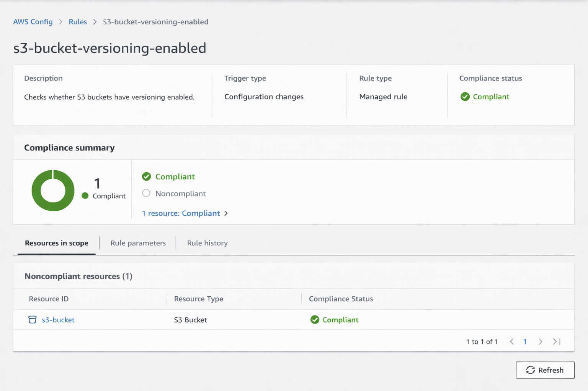

# AWS Config Resource Governance Framework
Status: Production-ready governance baseline model
Scope: Single-account AWS Config implementation
Evaluation Mode: Continuous
Control Type: Detective (with manual remediation)

Enterprise-style AWS Config governance framework enforcing S3 KMS encryption, EC2 mandatory tags, and S3 versioning with continuous compliance validation.

---

## Table of Contents

- Overview
- Architecture
- Implemented Controls
- Compliance Lifecycle
- Governance Analysis
- Evidence
- Roadmap
- Conclusion

---

## Overview

This project demonstrates the implementation of a structured governance baseline using AWS Config managed rules to enforce:

- KMS-based encryption for S3 buckets
- Mandatory tagging standards for EC2 instances
- Versioning enforcement for S3 buckets

The framework models a continuous compliance lifecycle including detection, remediation, and validation.

## Governance Domains Covered

- Confidentiality (KMS Encryption Enforcement)
- Operational Accountability (Tag Enforcement)
- Resilience (S3 Versioning)
- Continuous Drift Detection (AWS Config)
---

## Architecture

Core Components:

- AWS Config Recorder (Continuous evaluation)
- Delivery Channel to S3 (Configuration history storage)
- Managed Rules:
  - s3-default-encryption-kms
  - required-tags
  - s3-bucket-versioning-enabled

The design enforces confidentiality, operational accountability, and resilience across monitored resources.

See `/architecture/` for diagrams.

## Architecture Diagram

---

## Implemented Controls

### 01 – S3 Default Encryption with KMS
Documentation:
`/controls/01-s3-kms-encryption.md`

Ensures all S3 buckets enforce SSE-KMS default encryption.

---

### 02 – EC2 Required Tags Enforcement
Documentation:
`/controls/02-ec2-required-tags.md`

Enforces governance metadata for accountability and cost allocation.

---

### 03 – S3 Versioning Enforcement
Documentation:
`/controls/03-s3-versioning.md`

Ensures versioning is enabled to improve data resilience.

---

## Compliance Lifecycle

The project demonstrates the full compliance workflow:

1. Detect configuration drift
2. Investigate affected resources
3. Remediate manually
4. Re-evaluate rule
5. Validate compliance state

See:

- `/compliance-lifecycle/detection.md`
- `/compliance-lifecycle/remediation.md`
- `/compliance-lifecycle/validation.md`

---

## Governance Analysis

This implementation is positioned as a foundational governance framework with risk and business alignment.

- Risk assessment:
  `/governance-analysis/risk-analysis.md`

- Business impact:
  `/governance-analysis/business-impact.md`

- Governance maturity model:
  `/governance-analysis/maturity-model.md`

---

## Evidence

Screenshots documenting:

- Noncompliant state (before remediation)
- Remediation actions
- Compliant validation after re-evaluation

See `/evidence/`.

### Sample Compliance Evidence

---

## Roadmap

Future enhancements include:

- Automated remediation with Lambda
- SCP preventive enforcement
- Multi-account Config Aggregators
- Conformance Packs
- Executive reporting integration

Details:
`/roadmap/future-enhancements.md`

---

## Conclusion

This repository demonstrates a structured governance baseline implemented using AWS Config managed rules and validated through a full compliance lifecycle.

Rather than deploying infrastructure, this project enforces standards that strengthen security posture, improve operational discipline, and support enterprise compliance maturity.

## Governance Control Summary

| Control | Objective | Risk Domain |
|----------|-----------|------------|
| S3 Default Encryption | Enforce encryption at rest | Confidentiality |
| EC2 Required Tags | Enforce accountability metadata | Operational Governance |
| S3 Versioning | Protect against data loss | Resilience |
